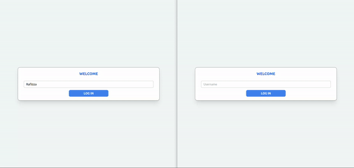
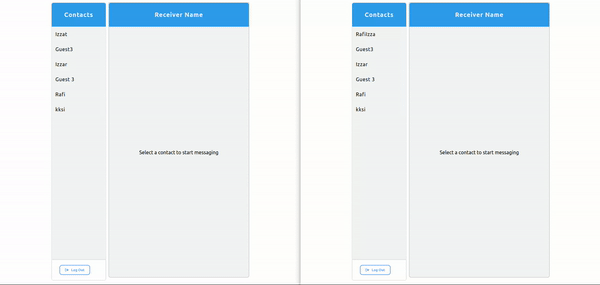
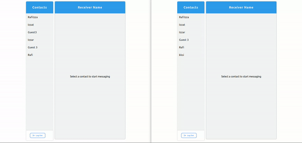
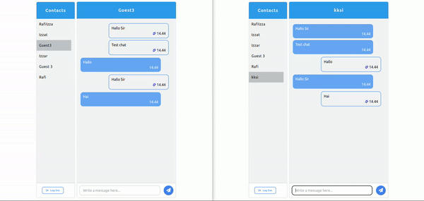

# Chat App

## Introduction

This is a simple full-stack React application to be able to send messages to friends, family, or other known people. An application based on [Mongoose](https://mongoosejs.com/), [ExpressJS](https://expressjs.com/), [ReactJS](https://react.dev/), [Redux](https://redux.js.org/), [TailwindCSS](https://tailwindcss.com/), [Node.JS](https://nodejs.org/en), [Socket.IO](https://socket.io/), and [Json Web Token or JWT](https://jwt.io/).

Client side code is written in React and the server API is written in ExpressJS.

## Before You Begin

Before you begin I recommend you to read about the basic building blocks that assamble this application:

* MongoDB - Go through [MongoDB Official Website](https://www.mongodb.com/) and proceed to their [Official Manual or Documentation](https://www.mongodb.com/docs/manual/tutorial/getting-started/), which should help you understand NoSQL and MongoDB better.

* Mongoose - You can start by visiting the [Mongoose Official Website](https://mongoosejs.com/) to understand more about one of the libraries for MongoDB and also learn about the Object Data Modeling (ODM) Library by reading the [Official Manual or Documentation](https://mongoosejs.com/docs/) from Mongoose.

* ExpressJS - The best way to understand ExpressJS is through it's [Official Manual or Documentation](https://expressjs.com/), which has a [Getting Started](https://expressjs.com/en/starter/installing.html) guide, as well an [ExpressJS](https://expressjs.com/en/guide/routing.html) guide for general express topics.

* ReactJS - React's [Official Website](https://react.dev/) is a great starting point.

* NodeJS - Start by going through [Node.JS Official Website](https://nodejs.org/en) which should get you going with the Node.JS platform.

## Prerequites

Make sure you have installed all of the following prerequisites on your development machine:
* Git - [Download & Install Git](https://git-scm.com/downloads). OSX and Linux machines typically have this already installed.

* Node.JS - [Download & Install Node.JS](https://nodejs.org/en/download/current), and the npm package manager.

* MongoDB - [Download & Install MongoDB](https://www.mongodb.com/docs/manual/installation/), and make sure it's running.

## Technologies

Made with technology that is quite busy being used now in large or small companies, including:

Front End:
* ReactJS
* React-Dom
* Redux
* Redux-Thunk
* Hooks
* Axios
* TailwindCSS
* FontAwesome
* ReactJS
* Socket.IO
  
_source files in ```client/``` folder_

Back End: 
* ExpressJS
* Mongoose
* cors

_source files in ```server/``` folder_

DataBase Management System(DBMS):
* MongoDB

## Entity

### User
* Username

## Features
* Log In and Log Out



* Create a new username automatically provided that the username is not the same as the existing username


* Selectable Chat



* Notification Number for Unread Messages



* Delete Chat



## Quick Start

Open terminal to run the server

```bash
# Clone the repository
git clone https://github.com/rafiizzaturohman/ChatApp

# Go inside the directory
cd ChatApp

# Install dependencies for server
cd server && npm install

# Start Server
npm start
```

Open new terminal to run the client

```bash
# Go inside the directiory
cd ChatApp

# Install dependencies for client
cd client && npm install
// Note: the process of installing dependencies for client dependencies can take some time.

# Start client
npm start
```

This application should run on port 3000, you can access it through browser, just go to http://localhost:3000/ for Client App and http://localhost:3005/ for RESTful API's.